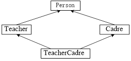
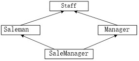

# 实验五 继承与派生
## 5.1 1．先阅读下列程序，写出执行结果。然后输入程序，调试程序，比较结果的正确性。
```cpp
#include <iostream>						// 预处理命令
using namespace std;						// 使用标准命名空间std

class A{
 public:
  A(){
    cout << "构造A" << endl;
  }		// 构造函数
  ~A(){
    cout << "析构A" << endl;
  }		// 析构函数
};

class B: public A{
 public:
  B(){
    cout << "构造B" << endl;
  }		// 构造函数
  ~B(){
    cout << "析构B" << endl;
  }		// 析构函数
};

class C: public B{
 public:
  C(){
    cout << "构造C" << endl;
  }		// 构造函数
  ~C(){
    cout << "析构C" << endl;
  }		// 析构函数
};

int main(){
  C obj;							// 定义对象
  return 0;                    			// 返回值0, 返回操作系统
}
```

## 5.2 先阅读下列程序，写出执行结果。然后输入程序，调试程序，比较结果的正确性。
```cpp
#include <iostream>						// 预处理命令
using namespace std;						// 使用标准命名空间std

class A{
 public:
  A(int x): a(x){}							// 构造函数
  void Show() const{
    cout << a << endl;
  }	// 显示a之值
 protected:
  int a;									// 数据成员
};

class B {
 public:
  B(int x): b(x){}						// 构造函数
  void Show() const{
   cout << b << endl;
  }	// 显示a与b之值

 protected:
  int b;								// 数据成员

};

class C: public A, public B
{
public:
  C(int x, int y): A(x), B(y){ }				// 构造函数
  void Show() const{ // 显示b之值
  cout << a << "," << b << endl;
  }
};

int main(){
  C obj(5, 18);						// 定义对象
  obj.Show();							// 显示相关信息
  obj.A::Show();						// 显示相关信息
  obj.B::Show();						// 显示相关信息

  return 0;                    			// 返回值0, 返回操作系统
}

```

## 5.3．下面程序主要测试类构造函数的初始化列表与作用域分辨符，请完成程序。
```cpp
#include <iostream>					// 预处理命令
using namespace std;					// 使用标准命名空间std

class A{
 private:
  int a;							// 数据成员

 public:
  A(int x):   [1] { }				// 构造函数
  void Show() const{				// 显示a之值
  cout << "a:" << a << endl;
  }
};

class B: public A {
protected:
  int b;							// 数据成员

public:
  B(int x, int y):   [2]  , b(y){ }		// 构造函数

void Show() const{					// 显示相关信息
  [3]  Show();				// 调用基类A的成员函数Show()
  cout << "b:" << b << endl;	// 显示b之值
  }
};

int main(){
  B obj(5, 18);					// 定义对象
  obj.Show();						// 显示相关信息

  system("PAUSE");            		// 调用库函数system( )，输出系统提示信息
  return 0;                    		// 返回值0, 返回操作系统
}
```
## 5.4 改正下面程序中的错误，使其能正常运行。
```cpp
#include <iostream>						// 预处理命令					
using namespace std;						// 使用标准命名空间std			

// 基类Base															
class Base{																	
 private:																
  int m;								// 数据成员					

 public:															
  Base(int a): m(a){ }					// 构造函数					
  Base(const Base &copy) : m(copy){ }	// 复制构造函数				
  void Show() const{						// 显示m之值					
    cout << "m:" << m << endl;
  }									
};															

// 派生类Derived												
class Derived: private Base{															
 protected:															
  int n;							// 数据成员						

 public:															
  Derived(int a, int b): b(a) { n =b; }	// 构造函数					
  void Show() const{					// 显示相关信息																	
  Base::Show();				// 调用基类Base的成员函数Show()
  cout << "n:" << n << endl;	// 显示n之值						
  }																
};																

int main(){					// 主函数		

  Derived obj(10, 18);		// 定义对象								
  obj.Show();				// 显示相关信息							

  return 0;          			// 返回值0, 返回操作系统				
}				
```

## 5.5．定义Person（人）类
-   [ ] 由Person分别派生出Teacher（教师）类和Cadre（干部）类，
-   [ ] 再由Teacher（教师）类和Cadre（干部）类采用多重继承方式派生出新类TeacherCadre（教师兼干部）类，各类之间的继承关系如图1.1所示

-   [ ] 在Person类中包含的数据成员有姓名(name）、年龄(age)、性别(sex)。在Teacher类还包含数据成员职称(title)，在Cadre类中还包含数据成员职务(post)，在TeacherCadre类中还包含数据成员工资(wages)。
-   [ ] 在类体中定义成员函数。
-   [ ] 每个类都有构造函数与显示信息函数(Show)。

## 5.6 6．定义Staff（员工）类
-   [ ] 由Staff分别派生出Saleman（销售员）类和Manager（经理）类，
-   [ ] 再由Saleman（销售员）类和Manager（经理）类
-   [ ] 采用多重继承方式派生出新类SaleManager（销售经理）类

各类之间的继承关系如图1.2所示。


-   [ ] 在Staff类中包含的数据成员有编号(num）、姓名(name)、出勤率(rateOfAttend)、基本工资(basicSal)和奖金(prize)。在Saleman类中还包含数据成员销售员提成比例(deductRate)和个人销售额(personAmount)，在Manager类中还包含数据成员经理提成比例(totalDeductRate)和总销售额(totalAmount)。在SaleManager类中不包含其它数据成员。
-   [ ] 各类人员的实发工资公式如下：
```plaintext
员工实发工资 = 基本工资 + 奖金 * 出勤率
销售员实发工资 = 基本工资 + 奖金 * 出勤率 + 个人销售额 * 销售员提成比例
经理实发工资 = 基本工资 + 奖金 * 出勤率 + 总销售额 * 经理提成比例
销售经理实发工资 =基本工资 + 奖金 * 出勤率 + 个人销售额 * 销售员提成比例+ 总销售额 * 经理提成比例
```
-   [ ] 每个类都有构造函数、输出基本信息函数(Output)和输出实发工资函数(OutputWage)。
