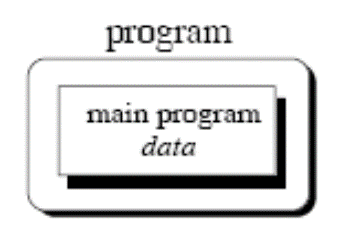
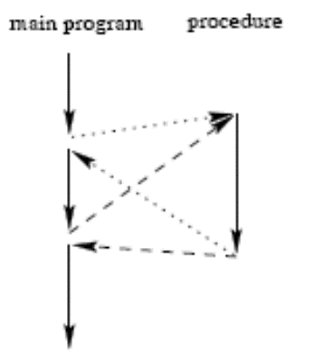
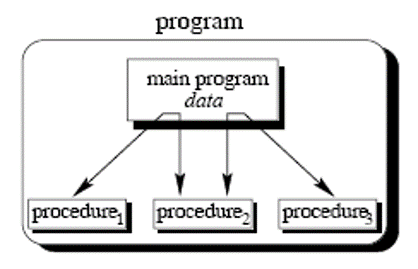
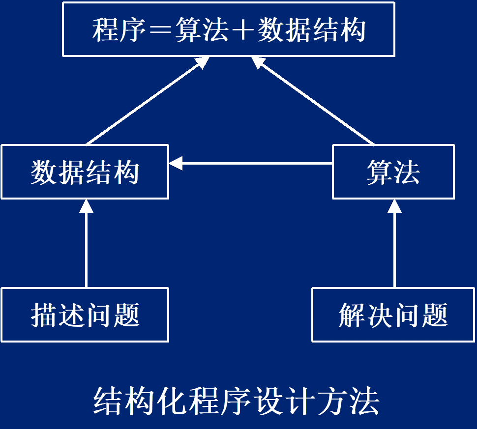
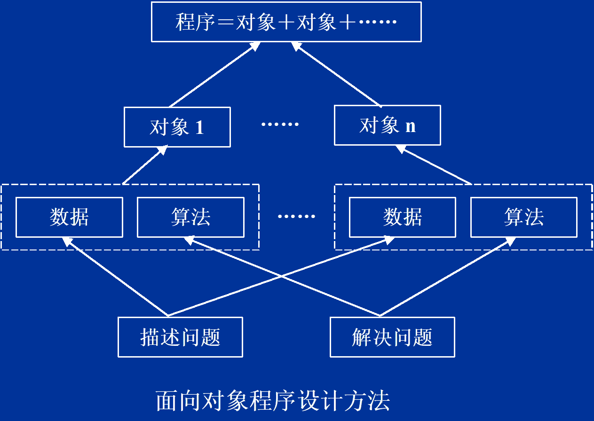

# 第一章 C++的变迁

## 1.1 计算机程序

### 特点
- 计算机的工作是用程序来控制的。
- 程序是指令的集合。
- 指令是计算机可以识别的命令。

### 面向对象的语言
出发点：

更直接地描述客观世界中存在的事物(对象)以及它们之间的关系。

特点：

- 是高级语言。
- 将客观事物看作具有属性和行为的对象。
- 通过抽象找出同一类对象的共同属性和行为，形成类。
- 通过类的继承与多态实现代码重用

## 1.2 C++ / 标准C++

C++
```cpp
#include <iostream.h>
int main()
{
	cout<<1+1<<endl;
}
```

标准C++
```cpp
#include <iostream>
int main()
{
	std::cout<<1+1<< std:: endl;
}
```

## 1.3 标准C++

#### 新增元素

- 名字空间
- 新的类型转换操作符
- bool数据类型
- 运算符关键字
- 与类相关的新特性
  - 运行时类型信息RTTI
  - explicit构造函数
  - mutable类成员
  - 类成员指针.*和->*
  - virtual基类
- 丰富的模板库STL

#### 头文件现状

- 标准C++头文件
  - 不再使用.h扩展名，全部在`std`名字空间
  - 如`<iostream>`等，所包含功能和对应旧头文件类似
- 旧的C++头文件名
  - 早期以.h为扩展名的C++头文件，没有名字空间
  - 如`<iostream.h>`等，但已不在官方标准中

- 标准C头文件
  - 标准C语言所提供的头文件，以.h为扩展名
  - 如`<stdio.h>`等
- 具有C库功能的新C++头文件
  - 无.h扩展名，文件名以c开头，并全部在名字空间std中
  - 如：`<cstdio>`代替`<stdio.h>`头文件，并提供类似功能

## 1.4 名字空间

- 程序在不同的范围包括许多不同的标识符;
  - 当不同的范围重叠时，则可能导致问题
  - 名字空间污染（namespace pollution）
- 名字空间(namespace)定义了范围
 将变量和标识符名字空间里面
```cpp
namespace namespace_name
{
  members
}
```
- 通过“名字空间::成员名”的方式访问
```cpp
namespace_name::member_name
```
- 未命名的名字空间是全局
- 名字空间可以嵌套

### using关键字

语法：`using namespace namespace_name;`

作用：在该名字空间里面的成员可以直接访问，而不需要使用namespace_name::

范例：

`using namespace std;`
直接访问名字空间std所有标识符，而不需要前缀std

`using std::cout`
仅开放名字空间std中的cout标识符，可以直接使用cout来代替std::cout;
若想使用std中的cin，则必须std::cin

## 1.5 cin，cout，endl，cerr
- `cin`:  标准输入流（一般默认从键盘输入）
- `cout`：标准输出流（默认向显示屏输出）
- `cerr`：标准错误流
- `endl`：结束并换行（endline）

## 1.6 提取运算符>>和插入运算符<<
提取运算符`>>`与`cin`配合使用，表示从输入设备上提取输入信息到内存中。
```cpp
 cin>>x>>y>>z;
```

插入插入运算符`<<`一般与`cout`配合使用，表示将待输出内容插入到（屏幕）当前输出位置。
```cpp
cout<<x<<“,”<<y<<endl;
```
## 1.7 命令行参数

通常，main函数定义为`int main( )`，如果带参数，则格式为：
```cpp
int main(int argc, char* argv[]);
```
`argc`：命令行参数的个数，

`argv`：字符型指针数组，其各指针分别指向命令行中命令名和各个参数的字符串

其中argv [0]指向命令名字符串，argc的取值从argv[1]开始（下标从1开始）

```cpp
// filename test
#include <iostream>
int main(int argc, char** argv) {
	std::cout<<argv[1]<<","<<argv[2]<<std::endl;
	return 0;
}
```
```
$ test 32 hello
```
output
```
32 hello
```
## 1.8 字符串处理

### 1.8.1 从字符串处理看C++变迁

- 有三个头文件中可用于处理字符串
  - `<string.h>`：旧的C头文件
  - `<cstring>`：旧C头文件的std版
  - `<string>`：新的标准C++头文件

[从字符串处理看C++变迁](https://github.com/chenboshuo/cpp_learning/commits/master/the_content_of_class/simple_string_processing.cpp)

```cpp
#include <stdio.h>
#include <string.h>
#include <stdlib.h>// malloc
main(){
char * str1;

char * str2="Test";
str1=(char * )malloc(5);
strcpy(str1,str2);
printf("%s\n", str1);
free(str1);
}
```

``` cpp
#include <cstring>
#include <iostream>
using namespace std;
main(){
char * str1;
char * str2="Test" ;
str1=new char[50];
strcpy(str1,str2);
cout<<str1;
delete[] str1;
}
```
```cpp
#include <string>
#include <iostream>
using namespace std;
main(){
string str1;
string str2("Test");
str1=str2;
cout<<str1;
}
```


### C语言的字符串处理

- C语言中没有“字符串”数据类型
- 字符串被处理为由字符指针指向的、存储在字符数组里的字符序列
- 最后加上了一个空字符‘\0’，作为字符串的结束标志
- 字符串常量被编译程序自动转换成具有这种形式的数组，该数组的开始地址被作为字符指针值使用
- 相关函数 `#include <string.h> `
  - `strcpy(char *, const char *)`
  字符串拷贝
  - `strlen(const char *)`
  取字符串长度
  - `strcat(char *, const char *)`
  字符串连接
  - `strcmp(const char *, const char *)`
  字符串比较
  - `strstr(const char *, const char *)`
  在主串中查找指定的子串

[反转字符串](https://github.com/chenboshuo/cpp_learning/commits/master/the_content_of_class/inverse_string.cpp)

### C++ 字符串处理

- C++保留了C语言的字符串处理机制和相关的处理函数
  - 以`'\0'`结束字符序列，头文件仍为`<string.h>`
  - 并提供了完全兼容的`<cstring>`头文件，相关函数定义在`std`名字空间
- C++同时提供新的字符串类，封装对字符串的处理
  - 字符串为`string`类，头文件为`<string>`，在`std`名字空间
  - 该类直接支持各种字符串操作

## 1.9 动态内存处理

### C语言中的动态内存分配
- 头文件<stdlib.h>

`void* malloc(size_t size);`
向系统申请大小为size的内存块，把指向首地址的指针返回。如果申请不成功，返回NULL（一定要检查返回值）

`void free(void* block);`
释放由malloc()申请的内存块。block是指向此块首地址的指针（malloc()的返回值）

关于动态分配的内存
- 在“堆（heap）”中分配，内容随机;
- 被free/delete之前，永久有效;
- 在被free/delete之后，该块内存不再属于你;

###　C++中的动态内存分配
提供了动态内存管理的运算符：
`new`分配内存;
`delete`释放内存

new语法格式：
```cpp
指针标识符 = new  类型标识符;
指针标识符 = new  类型标识符(初始化值);
指针标识符 = new  类型标识符[数组维数];
```
delete语法格式：
```cpp
delete 指针标识符;
delete[] 指针标识符;
```

## 1.10 类型转化
`static_cast：`标准转换及其逆转换
void*转换为char*、int转换为float

`const_cast`：转换const或volatile，将转换掉表达式的常量性

`reinterpret_cast`：非标准强制转换
如void*转换为int、double转换为int

`dynamic_cast`：进行类对象间的转换

### 旧式强制类型转换

语法：
```cpp
// C++强制转换符号
type_name (expr);
// C语言强制转换符号
(type_name) expr;
```

### static_cast和reinterpret_cast的区别

s`tatic_cast`（静态转换）执行非多态的转换，用于代替C中通常的强制转换操作。
注意：不能用`static_cast`把`struct`转换成`int`类型或者把`double`类型转换成指针类型

`reinterpret_cast`（重述转换）主要是将数据从一种类型的转换为另一种类型。通常用在函数指针类型之间进行转换，而且使用`reinterpret_cast`的代码很难移植 。

## 1.11 程序设计方法


### Unstructured programming（无结构的）
The main program directly operates on global data

### Procedural programming（面向过程的）


### Modular programming （模块化的）


### Object oriented programming（面向对象的）
面向对象程序设计出现在80年代中后期;
面向对象程序设计是建立在结构化程序设计基础上的，但它不再是从功能入手，而是从 *对象*（人、地方、事情等）入手
面向对象程序设计以 *类* 作为构造程序的基本单位，它具有 *封装、数据抽象、继承、多态* 等特点.

简单地说，对象就是现实世界中的各种实体，包括人、地点和事物等。例如，桌子、椅子、教室、学生、老师、电话、汽车等等。一般都要从属性和行为两个方面来对它们加以描述。

类描述了一组具有相同属性（数据元素）和相同行为（函数）的对象。
类的数据成员是对对象属性的抽象，类的函数成员是对对象行为的抽象，而类本身就是对对象的抽象。

结构化程序设计方法是一种模块化程序设计方法，它在解决问题时是以功能为中心的，一定的功能模块虽然也作用于特定的数据，但它们并没有被封装在一起。

面向对象程序设计方法则是以对象为中心来解决问题的。属于同种对象的属性（数据）和服务（功能）被抽象出来封装到一起。
